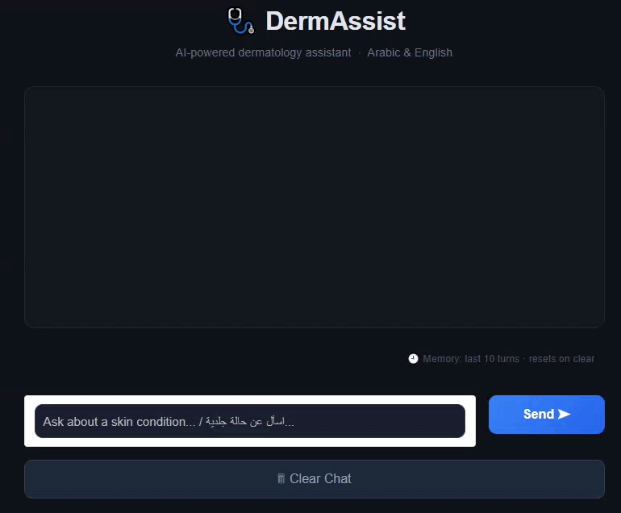

# 🩺 DermAssist — Dermatology AI Chatbot

A bilingual **Arabic / English** dermatology assistant powered by **Cohere LLM**.  
Answers skin-related questions only. Automatically detects and responds in the user's language.

🔗 **[Live Demo on Hugging Face Spaces](https://huggingface.co/spaces/Saraay/Dermatology_chatbot)**



---

## ✨ Features

- 💬 Conversational chat with memory (last 10 turns)
- 🌍 Bilingual: Arabic & English — auto-detected
- 🔒 Strictly limited to dermatology topics only
- ⚡ Powered by Cohere `command-a-03-2025`
- 🚀 REST API built with FastAPI
- 🖥️ Live UI demo hosted on Hugging Face Spaces

---


## 🛠️ Tech Stack

| Layer | Technology |
|---|---|
| API Framework | FastAPI |
| LLM Provider | Cohere (`command-a-03-2025`) |
| Demo UI | Gradio (Hugging Face Spaces) |
| Language | Python 3.10+ |
| Server | Uvicorn |

---

## 📁 Project Structure

```
├── src/
│   ├── main.py                  # App entry point, service initialization
│   ├── config.py                # Settings and environment variables
│   ├── api/
│   │   ├── routes.py            # API endpoints
│   │   └── schemes.py           # Request/Response models
│   ├── services/
│   │   ├── llm_service.py       # Cohere LLM provider
│   │   └── chat_service.py      # Core chatbot logic
│   ├── prompts/
│   │   └── system_prompt.py     # System prompt for the LLM
│   └── utils/
│       └── helpers.py           # Chat history formatter
├── requirements.txt
├── .env                         # Environment variables (not committed)
└── README.md
```

---

## ⚙️ Setup & Installation

### 1. Clone the repository

```bash
git clone https://github.com/SaraaElsayed/Dermatology-Chatbot
cd Dermatology-Chatbot
```

### 2. Create a virtual environment

```bash
python -m venv venv
source venv/bin/activate        # Windows: venv\Scripts\activate
```

### 3. Install dependencies

```bash
pip install -r requirements.txt
```

### 4. Configure environment variables

```bash
cp .env.example .env
```

```env
COHERE_API_KEY=your_cohere_api_key_here
GENERATION_MODEL_ID=command-a-03-2025
```

### 5. Run the server

```bash
uvicorn src.main:app --host 0.0.0.0 --port 8000 --reload
```

API available at `http://localhost:8000`

---

## 📡 API Endpoints

### `GET /api/v1/health`

```json
{
  "status": "ok",
  "message": "Dermatology API is running",
  "chat_service_ready": true
}
```

### `POST /api/v1/chat`

**Single turn:**
```json
{
  "query": "What causes acne?",
  "chat_history": []
}
```

**Multi-turn:**
```json
{
  "query": "How do I treat it?",
  "chat_history": [
    { "role": "user", "content": "What causes acne?" },
    { "role": "assistant", "content": "Acne is caused by..." }
  ]
}
```

**Response:**
```json
{
  "answer": "Acne is primarily caused by excess sebum production..."
}
```

---

## 🔑 Environment Variables

| Variable | Required | Default | Description |
|----------|----------|---------|-------------|
| `COHERE_API_KEY` | ✅ | — | Your Cohere API key |
| `GENERATION_MODEL_ID` | ❌ | `command-a-03-2025` | Cohere model ID |

---

## ⚠️ Disclaimer

This assistant provides general information only and is **not a substitute** for professional medical advice. Always consult a licensed dermatologist.
